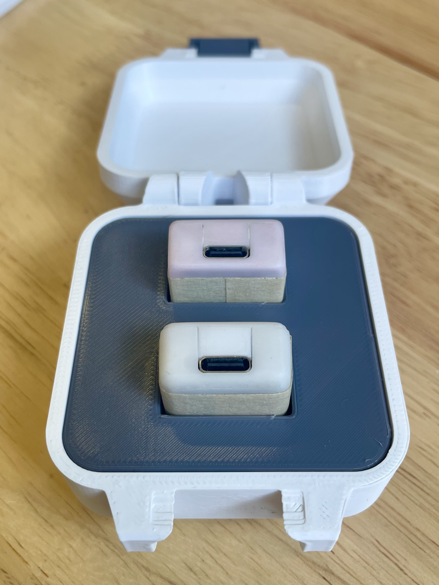
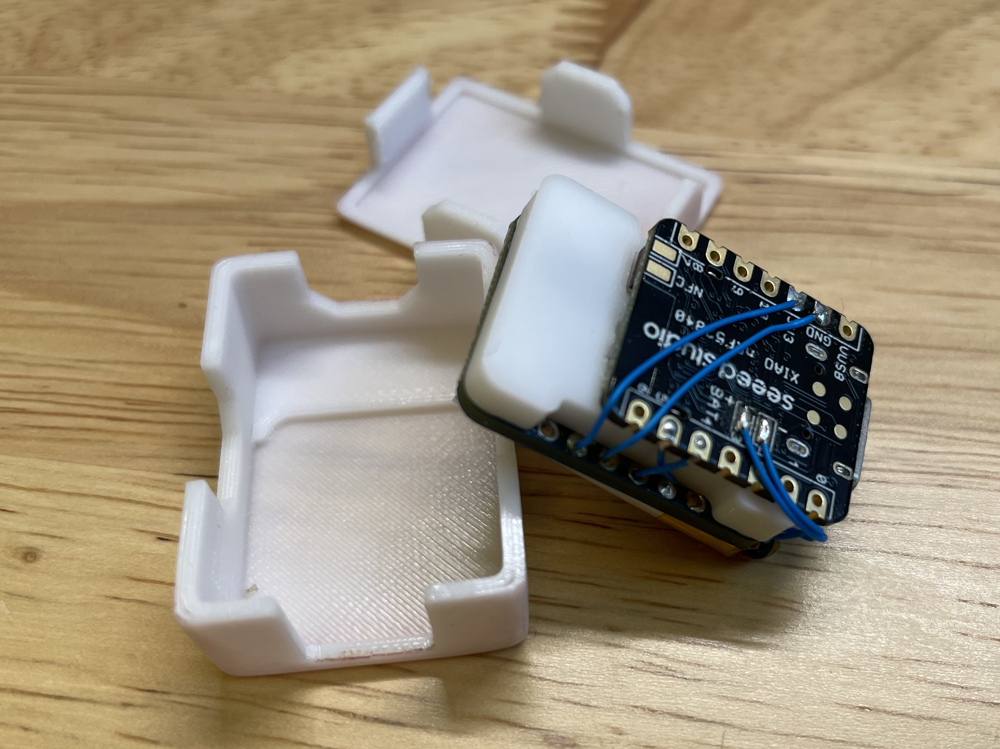

# Wireless IMU

## Overview
The Wireless Inertia Measurement Unit (IMU) project, implemented using Seeed Studio Xiao nRF52840 and Bosch BNO055, was designed and fabricated by Fred Wang in May 2023. The project features two identical IMUs for measuring relative positioning, connecting to a PC via Bluetooth Low Energy (BLE) protocol. Detailed implementation is available in the Python scripts in the root folder.



## Internal Components
Each unit comprises the following components:
- Seeed Studio Xiao nRF52840
- Bosch BNO055 9-axis IMU
- LiPo battery
- 3D-printed separator



## Synchronization
Due to the wireless nature of the IMUs, synchronizing with other measuring devices can be challenging. A separate Arduino Uno is used to receive sync signals and communicate with the PC via a serial port. For more details, refer to `imu_recording.py` and `mocap_sync`.


## Folder Structure
```
Wireless_IMU
├───cad                         - SolidWorks files for the units
├───mocap_sync                  - Arduino code for syncing
├───validation
│ ├───Dual_wirelesIMU
│ ├───FSS_teensy
│ └───validation_with_VN100
├───wirelessIMU_1               - Code for unit 1
│ ├───Adafruit_BNO055_modded
│ └───IEEE_11073_float
├───wirelessIMU_2               - Code for unit 2
│ ├───Adafruit_BNO055
│ ├───Adafruit_BNO055_modded
│ └───IEEE_11073_float
└───wirelessIMU_Station         
├───Adafruit_BNO055
├───Adafruit_BNO055_modded
└───IEEE_11073_float
```


## Additional Information
For detailed implementation and usage instructions, please refer to the Python scripts provided in the root folder. These scripts offer guidance on setting up and operating the wireless IMUs, including synchronization with other measurement devices using the Arduino Uno.
